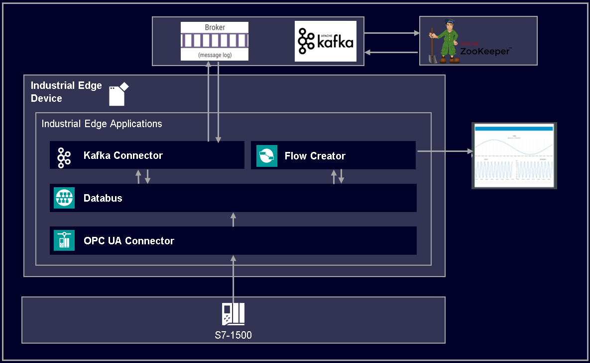

# Apache Kafka Connector

Connect Industrial Edge Device to Apache Kafka 

- [Apache Kafka Connector](#apache-kafka-connector)
  - [Description](#description)
    - [Overview](#overview)
    - [General task](#general-task)
  - [Requirements](#requirements)
    - [Used Components](#used-components)
    - [TIA Project](#tia-project)
    - [Prerequisites](#prerequisites)
  - [Installation](#installation)
  - [Usage](#usage)
  - [Implementation](#implementation)
  - [Documentation](#documentation)
  - [Contribution](#contribution)
  - [License and Legal Information](#license-and-legal-information)
  - [Disclaimer](#disclaimer)

## Description

### Overview

The Apache Kafka Connector connects to the Databus and Apache Kafka. The Connector can subcribes to MQTT Topics on Databus and produces messages (events, records) on a Kafka Topic. Also the Connector can consume messages from a Kafka Topic and publishes messages to MQTT Topics on Databus.

### General task

This example shows how to connect your Industrial Edge Device to Apache Kafka. Therefore a SIMATIC PLC is used as datasource. The OPC UA Connector reads the data from the PLC and publish them on Databus. The Apache Kafka Connector consists of two services, the "kafka-producer" and "kafka-consumer". The "kafka-producer" subscribes to the Databus, gets data from OPC UA Connector and produces messages in an Apache Kafka Broker's topic. The "kafka-consumer" subscribes to the same topic on the Apache Kafka Broker and publishes the data an other topic on Databus. The Flow Creator can be used to verify the data exchange between Industrial Edge and Apache Kafka.

## Requirements

### Used Components

- OS: Windows or Linux
- Docker minimum V18.09
- Docker Compose V2.0 – V2.4
- Industrial Edge App Publisher (IEAP) V1.2.8
- Industrial Edge Management (IEM) V1.5.2-4 / V1.11.8
  - OPC UA Connector V1.8.1
  - Common Connector Configurator V1.8.1-4
  - Databus V2.0.0-4
  - Databus Configurator V2.0.0-5
  - IE App Configuration Service V1.2.2
- Industrial Edge Device (IED) V1.10.0-9
- TIA Portal V16 
- PLC: CPU 1512 FW 2.8.3

### TIA Project

The used TIA Portal project can be found in the [miscellaneous repository](https://github.com/industrial-edge/miscellaneous) in the tank application folder and is also used for several further application examples:

- [Tia Tank Application](https://github.com/industrial-edge/miscellaneous/tree/main/tank%20application)

### Prerequisites
Before using this application make sure you have a running Apache Kafka Broker. To setup up a test environment either follow the [Apache Kafka Quickstart guide](https://kafka.apache.org/quickstart) or use the provided [docker-compose.yml](./test/kafka-broker/docker-compose.yml) as described [here](./docs/installation.md#apache-kafka-broker-test-environment)

## Installation

You can find the further information about the following steps in the [docs](./docs)

- [Build application](docs/installation.md#build-application)
- [Upload application to Industrial Edge Management](docs/installation.md#upload-application-to-industrial-edge-management)
- [Configure and install application to Industrial Edge Device](docs/installation.md#install-application-on-industrial-edge-device)

## Usage

Connect your Industrial Edge Device to a PLC as datasource over the network.

Provide a Apache Kafka Broker (see [Prerequisites](#prerequisites)) that is accessible for the Industrial Edge Device over the network

Use e.g. Flow Creator to verify data exchange to and from Apache Kafka Broker.

## Implementation

How to implement a Apache Kafka Producer and Consumer as well as further details about the source code can be found in the [implementation section](./docs/implementation.md).

- [App Configuration](./docs/implementation.md#app-configuration)
- [Connect to IE Databus](./docs/implementation.md#connect-to-ie-databus)
- [Connect to Apache Kafka](./docs/implementation.md#connect-to-apache-kafka)

## Documentation
 
- You can find further documentation and help in the following links
  - [Industrial Edge Hub](https://iehub.eu1.edge.siemens.cloud/#/documentation)
  - [Industrial Edge Forum](https://forum.mendix.com/link/space/industrial-edge)
  - [Industrial Edge landing page](https://new.siemens.com/global/en/products/automation/topic-areas/industrial-edge/simatic-edge.html)
  - [Industrial Edge GitHub page](https://github.com/industrial-edge)
  - [Industrial Edge documentation page](https://docs.eu1.edge.siemens.cloud/index.html)
  
## Contribution

Thank you for your interest in contributing. Anybody is free to report bugs, unclear documentation, and other problems regarding this repository in the Issues section.
Additionally everybody is free to propose any changes to this repository using Pull Requests.

If you are interested in contributing via Pull Request, please check the [Contribution License Agreement](Siemens_CLA_1.1.pdf) and forward a signed copy to [industrialedge.industry@siemens.com](mailto:industrialedge.industry@siemens.com?subject=CLA%20Agreement%20Industrial-Edge).

## License and Legal Information

Please read the [Legal information](LICENSE.txt).

## Disclaimer

IMPORTANT - PLEASE READ CAREFULLY:

This documentation describes how you can download and set up containers which consist of or contain third-party software. By following this documentation you agree that using such third-party software is done at your own discretion and risk. No advice or information, whether oral or written, obtained by you from us or from this documentation shall create any warranty for the third-party software. Additionally, by following these descriptions or using the contents of this documentation, you agree that you are responsible for complying with all third party licenses applicable to such third-party software. All product names, logos, and brands are property of their respective owners. All third-party company, product and service names used in this documentation are for identification purposes only. Use of these names, logos, and brands does not imply endorsement.