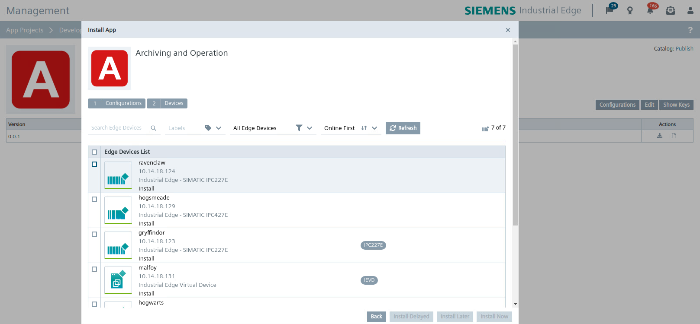
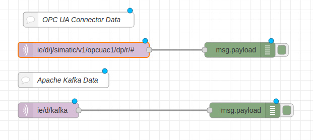

# Installation

- [Installation](#installation)
  - [Build Application](#build-application)
    - [Download Repository](#download-repository)
    - [Build docker images](#build-docker-images)
  - [Upload Application to Industrial Edge Management](#upload-application-to-industrial-edge-management)
    - [Connect your Industrial Edge App Publisher](#connect-your-industrial-edge-app-publisher)
    - [Create new Application in Industrial Edge Management](#create-new-application-in-industrial-edge-management)
    - [Configure IE Databus and SIMATIC S7 Connector](#configure-ie-databus-and-simatic-s7-connector)
    - [Add Edge App configuration & upload configuration file to Industrial Edge Management](#add-edge-app-configuration--upload-configuration-file-to-industrial-edge-management)
      - [MQTT](#mqtt)
      - [KAFKA](#kafka)
      - [CONSUMER_TOPICS](#consumer_topics)
      - [CONSUMER_TOPICS](#consumer_topics-1)
  - [Install Application on Industrial Edge Device](#install-application-on-industrial-edge-device)
    - [Edge App configuration](#edge-app-configuration)
      - [IE Databus](#ie-databus)
        - [User](#user)
      - [Kafka](#kafka-1)
      - [Topics](#topics)
      - [Producer Topics](#producer-topics)
      - [Consumer Topics](#consumer-topics)
    - [Install Edge App](#install-edge-app)
  - [Apache Kafka Broker Test-Environment](#apache-kafka-broker-test-environment)
    - [Example Environment](#example-environment)
    - [Run Apache Kafka Broker](#run-apache-kafka-broker)
    - [Test](#test)

## Build Application

### Download Repository
Download or clone the repository to your workstation.

### Build docker images

Open terminal in the project root path where docker-compose.yml is located and execute: 
```bash
docker-compose build
```
This command builds the docker images of the services which are specified in the docker-compose.yml file. **For a deeper implementation understanding, click** [here](./implementation.md)

## Upload Application to Industrial Edge Management

You find below a short description how to publish your application in your IEM.

For more detailed information please see the section for [uploading apps to the IEM](https://github.com/industrial-edge/).

### Connect your Industrial Edge App Publisher

- Connect your Industrial Edge App Publisher to your Docker engine
- Connect your Industrial Edge App Publisher to your Industrial Edge Managment

### Create new Application in Industrial Edge Management

- Create a new Project or select a existing one
- Create new Application
- Import the [docker-compose](../docker-compose.yml) file using the **Import YAML** button
- The warnings <br>
  `Build (Detail) (services >> kafka-producer >> build) is not supported.` <br> 
  `Build (Detail) (services >> kafka-consumer >> build) is not supported.` <br>
  can be ignored

- Click on `Review` and `Validate & Create`. 

- **Start Upload** to transfer the app to Industrial Edge Managment
- Further information about using the Industrial Edge App Publisher can be found in the [IE Hub](https://iehub.eu1.edge.siemens.cloud/documents/appPublisher/en/start.html)

---

### Configure IE Databus and SIMATIC S7 Connector  
1. Configure a user with password in the IE Databus for the SIMATIC S7 Connector and the Apache Kafka Connector Application for publishing and subscribing to topics on the IE Databus. 
   ```txt
   User name: edge 
   Password: edge 
   Topic: ie/# 
   Permission: Publish and Subscribe
   ```


1. Add the PLC as a data source with data source type e.g. OPC-UA.
2. Add variables to collect data.


1. Enter Databus credentials <br>

<a href="graphics/simatic-s7-connector-bulk.png"></a>
<br>

### Add Edge App configuration & upload configuration file to Industrial Edge Management
The Apache Kafka Connector can be configured with a form. The form is based on JSONForms. If no configuration is provided during app installation, the application uses default values seen in the following json-file.

```json
{
  "MQTT": {
    "HOST": "ie-databus",
    "PORT": "1883",
    "USERNAME": "edge",
    "PASSWORD": "edge"
  },
  "KAFKA": {
    "HOST": "192.168.253.143",
    "PORT": "9092"
  },
  "CONSUMER_TOPICS": [
    {
      "MQTT": "ie/d/kafka",
      "KAFKA": "EdgeDevice"
    }
  ],
  "PRODUCER_TOPICS": [
    {
      "MQTT": "ie/d/j/simatic/v1/s7c1/dp/r/#",
      "KAFKA": "EdgeDevice",
      "KEY": "S7-Connector"
    }
  ]
}
```

#### MQTT
- HOST: This is the service name of the IE Databus
- PORT: This is the port of the IE Databus
- USER, PASSWORD: The user and password are configured in the IE Databus and used in the SIMATIC S7 Connector for accessing (publish, subscribe) to topics on the IE Databus

#### KAFKA
- HOST: This is the DNS-Name or IP-Address of the Kafka-Broker 
- PORT: This is the port of the Kafka-Broker

#### CONSUMER_TOPICS
This is a Topic Map list, mapping Apache Kafka topics to IE Databus topics
- MQTT Topic: Topic on IE Databus
- Kafka Topic: Topic on Apache Kafka

#### CONSUMER_TOPICS
This is a Topic Map list, mapping IE Databus topics to Apache Kafka topics
- MQTT Topic: Topic on IE Databus
- Kafka Topic: Topic on Apache Kafka
- Kafka Key: Key of Kafka-Message (message on Kafka consists of a key value pair)

1. Select your application in Industrial Edge App Publisher
   


2. Add Configuration to application
   ```txt
   Display Name: Configuration
   Description: JSONForms Configuration
   Host Path: ./cfg-data/
   Add Template 
   - Name: JSONForms
   - Description: JSONForms Configuration
   - JSON Schema: set checkbox
   ```

JSONForms file is located [here](../src/config/config.json)


## Install Application on Industrial Edge Device

### Edge App configuration
Fill out Input-Form and select checkbox to select configuration(check box green). Insert for example the default values like shown before.


#### IE Databus
- MQTT Broker IP: optional
- Port: optional
##### User
- Usernname: required
- Password: required
#### Kafka
- Host: required
- Port: required
#### Topics
#### Producer Topics
- MQTT: required
- Kafka: required
- Key: required
#### Consumer Topics
- MQTT: required
- Kafka: required


### Install Edge App
Install Edge Application to Industrial Edge Device



---

## Apache Kafka Broker Test-Environment

Setup Apache Kafka Broker to test Apache Kafka Connector. To startup a test environment of Apache Kafka a docker-compose.yml can be found [here](../test/kafka-broker/docker-compose.yml)

### Example Environment

- OS: Windows or Linux
- Docker
- Docker Compose

### Run Apache Kafka Broker

Adjust docker-compose.yml according to your environment. Insert IP address of your environment in "KAFKA_ADVERTISED_LISTENERS".
```yml
  environment:
    KAFKA_ZOOKEEPER_CONNECT: zookeeper:2181
    KAFKA_ADVERTISED_LISTENERS: PLAINTEXT://192.168.253.143:9092
    KAFKA_OFFSETS_TOPIC_REPLICATION_FACTOR: 1 
```

Open terminal where Apache Kafka Broker docker-compose.yml is located and execute: 
```bash
docker-compose up
```

### Test

Install IE Flow Creator on Industrial Edge Device.
Use flow provided [here](../test/ie-flow-creator/kafka.json). Insert Security Settings in MQTT-Node before using the Flow.

